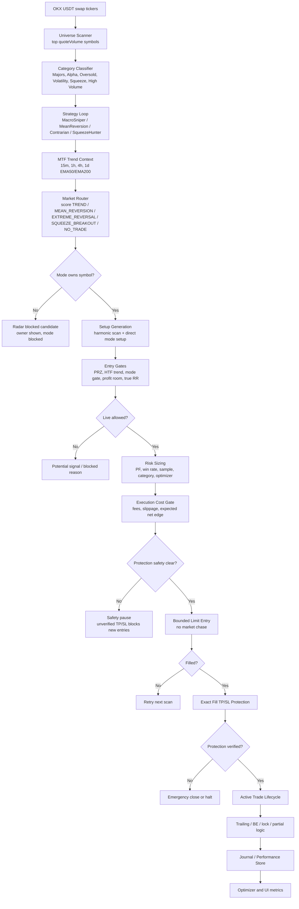
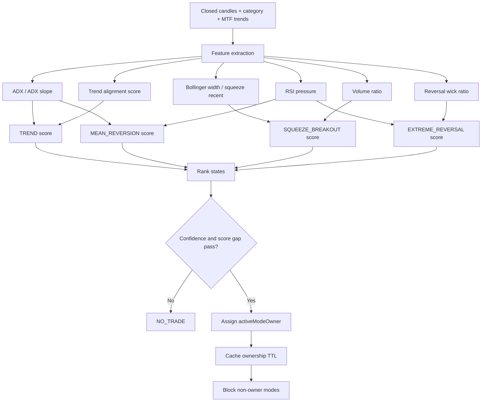
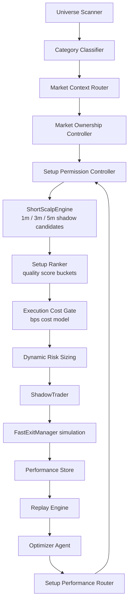
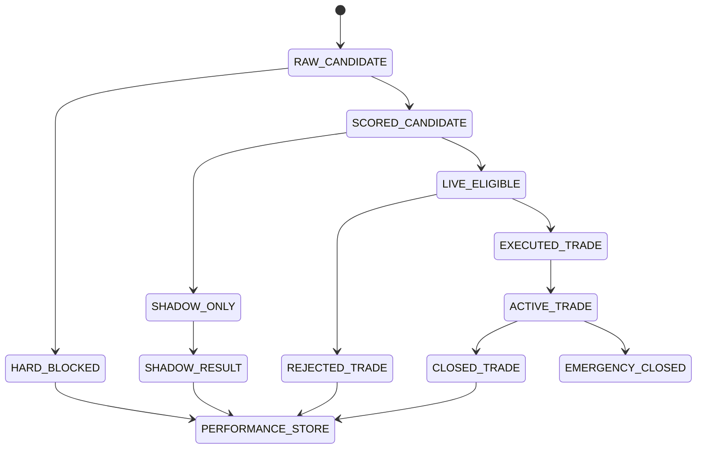

# Data Flow Diagram

Audit date: 2026-07-18

This document describes the current real code path and the recommended target path for the requested short-scalp optimization system.

## Current Runtime Flow



## Current Market Router Flow



## Current Four-Mode Assignment

| Market state | Owner mode | Main purpose |
| --- | --- | --- |
| TREND | MacroSniper | Trend pullback and continuation |
| MEAN_REVERSION | MeanReversion | Range snapback and Bollinger re-entry |
| EXTREME_REVERSAL | Contrarian | Exhaustion reversal with proof |
| SQUEEZE_BREAKOUT | SqueezeHunter | Volatility compression release |
| NO_TRADE | none | Weak, ambiguous, or unsafe context |

## Target Phase 2-7 Flow

The requested target architecture should add observability and replayable short-scalp components without bypassing the current safety layer.



## Target Candidate Lifecycle



## Required Event IDs

The target flow should persist these IDs for every candidate/trade:

- `market_event_id`: the market router scoring event.
- `setup_event_id`: the setup candidate event.
- `trade_event_id`: the live or shadow trade event.
- `lifecycle_id`: the current net lifecycle record already used by the engine.

## Phase 2 Minimal Event Schema

```json
{
  "event_id": "uuid",
  "timestamp": "2026-07-18T00:00:00Z",
  "symbol": "SOL-USDT-SWAP",
  "mode": "MacroSniper",
  "market_state": "TREND",
  "market_owner": "MacroSniper",
  "setup_type": "TREND_PULLBACK",
  "direction": "LONG",
  "candidate_state": "BLOCKED",
  "reason_code": "TRUE_RR_TOO_LOW",
  "quality_score": 61.5,
  "expected_move_bps": 18.2,
  "estimated_cost_bps": 9.1,
  "net_edge_bps": 9.1,
  "feature_snapshot": {}
}
```

## Critical No-Future-Leak Rule

The current scanner often uses `signal_df = df.iloc[:-1]` before generating candidates. Any replay or short-scalp module must keep this rule explicit:

- Never use an unfinished candle for signal confirmation.
- Market context should be derived from candles closed before the candidate timestamp.
- Execution simulation may use post-signal ticks/candles only after the signal timestamp.

