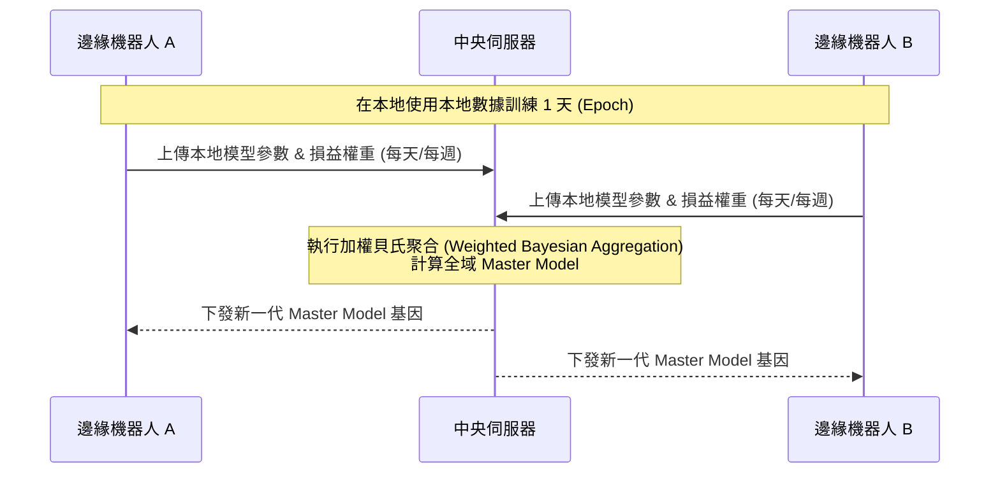

# 統一機器人訓練中心架構設計 (Unified Trading Robot Training Center Architecture)

為了解決「多台機器人分布式訓練，最終回饋聚合至一台獲利主機器人」的需求，我們可以借鑑機器學習中的 **參數伺服器 (Parameter Server)**、**聯合學習 (Federated Learning)** 與 **集中式數據湖 (Data Lake)** 的架構設計。

以下是三種最適合實作的系統架構方案：

---

## 方案一：動態參數伺服器架構 (Real-Time Parameter Server) — [推薦：實時進化]

這個架構最適合您目前以規則和 ATR 為基礎的優化器。中央伺服器充當「大腦」，多台 Mac Mini 邊緣機器人充當「觸角（探針）」。

```mermaid
graph TD
    subgraph 中央伺服器 (Master Core)
        DB[(全域交易數據庫)]
        Optimizer[ML 核心調參引擎]
        Broadcast[參數分發 API]
    end
    
    subgraph 邊緣節點 (Edge Robots)
        R1[機器人 A - 激進探索] -->|實時平倉回報 REST API| DB
        R2[機器人 B - 保守探索] -->|實時平倉回報 REST API| DB
        R3[機器人 C - 標準探索] -->|實時平倉回報 REST API| DB
        
        Broadcast -->|定期 Pull / WebSocket 推送最優參數| R1
        Broadcast -->|定期 Pull / WebSocket 推送最優參數| R2
        Broadcast -->|定期 Pull / WebSocket 推送最優參數| R3
    end
```

### 1. 運作流程
*   **邊緣端**：每台機器人被賦予不同的「探索因子」（例如：A 機器人專門測試寬止損、B 機器人測試窄止損）。每當有交易平倉，邊緣端立刻透過 HTTP API 將該筆交易的損益、持有時間、當時大盤 Regime 等發送給中央伺服器。
*   **中央端**：中央伺服器將所有機器人的回傳數據進行統一彙整，使用全域的 Expectancy 與 Profit Factor 演算法重新擬合，生成最新版的「全域最優參數 DNA」。
*   **分發同步**：每隔 1 小時或在每次開單前，邊緣機器人向中央端請求最新的 DNA 參數（如最優 `sl_atr`, `tp_atr`, `confidence_weight`）。

### 2. 優點
*   **極速演化**：任何一台機器人踩坑（止損），其失敗經驗會在一秒內轉化為全域參數的調整，防止其他機器人犯相同的錯誤。
*   **參數統一**：最終會自然誕生一台「只使用全域最優 DNA」的主獲利機器人。

---

## 方案二：聯合學習與定期權重聚合架構 (Federated Learning / Epoch Aggregation) — [低網速與去中心化]

若您的邊緣節點部署在不同網絡環境下，且不希望中央伺服器因網絡中斷而導致所有機器人停止更新，可採用此異步聚合架構。



### 1. 運作流程
*   各機器人節點在本地獨立運作，並在本地運行自己的 AI 學習算法（生成各自的優化檔與交易日誌）。
*   在固定的時間週期（如每天午夜），各節點將本地的優化成果與業績數據（DNA 權重）打包上傳至中央伺服器。
*   中央伺服器利用 **加權平均演算法**，將勝率高、PF 大的節點模型賦予極高權重，融合成全域 Master 模型，再回傳給各個節點。

### 2. 優點
*   **容錯性極高**：即使某台 Mac Mini 斷網幾天，它依然能在本地自我優化，聯網後再補報數據，不影響中央大腦的運作。

---

## 方案三：集中式數據湖與雲端優化架構 (Central Data Lake & Cloud Brain) — [適合重度 AI/強化學習]

如果您未來計畫引入深度強化學習（RL）或神經網絡模型，邊緣端（Mac Mini）將沒有足夠的算力進行動態擬合。此時需要將算力與執行徹底分離。

```mermaid
graph LR
    subgraph 執行端 (Edge Nodes)
        R1[Mac Mini 1] -->|實時串流數據| DB[(Cloud Data Lake)]
        R2[Mac Mini 2] -->|實時串流數據| DB
        
        Brain[雲端 AI 核心] -->|下發決策指令/開單信號| R1
        Brain -->|下發決策指令/開單信號| R2
    end
    
    subgraph 訓練端 (Cloud Compute)
        DB --> Train[GPU 訓練叢集 - PPO/LSTM]
        Train -->|更新模型| Brain
    end
```

### 1. 運作流程
*   **數據收集**：所有的 Mac Mini 機器人只負責採集行情數據（Candles, Orderbook）、提交雷達掃描結果，並實時串流（Streaming）寫入雲端的集中式數據湖（如時序數據庫 InfluxDB 或 PostgreSQL）。
*   **集中訓練**：雲端高效能 GPU 伺服器讀取數據湖，進行大規模回測、強化學習（RL）神經網絡訓練與演化計算。
*   **指令下發**：訓練好的雲端 AI 核心直接向各台 Mac Mini 下達「開單」、「平倉」或「修改止損」指令，Mac Mini 只負責執行。

### 2. 優點
*   **算力無上限**：Mac Mini 無需進行任何複雜的擬合，只需極低配置；而中央端可以使用最強大的雲端算力進行毫秒級的網絡擬合，獲利上限最高。

---

## 三、 給您的技術演進路線建議 (Roadmap)

> [!TIP]
> 建議採取**三步走**策略，從最輕量、最快落地的方案逐步演進：

1.  **第一階段（現狀延伸 - 方案一）**：
    將目前的 `trade_journal.json` 修改為寫入一個中央的 **SQLite / PostgreSQL 數據庫**。讓所有 Mac Mini 共享同一個數據庫讀寫權限。這是最快落地的「參數伺服器」雛形。
2.  **第二階段（服務化 - 方案一優化）**：
    用 Flask 在雲端寫一個輕量級的 `Master Server`。所有 Mac Mini 通過 API 與其對接。這時您可以在雲端實時觀察所有 Mac Mini 的總損益，並在雲端一鍵微調所有機器人的策略偏好。
3.  **第三階段（大數據化 - 方案三）**：
    當您的機器人規模達到 10 台以上時，引入 Kafka 或 MQTT 等隊列協議，將行情與開單回報標準化，徹底實現「雲端大腦決策、本地節點執行」的工業級量化架構。
